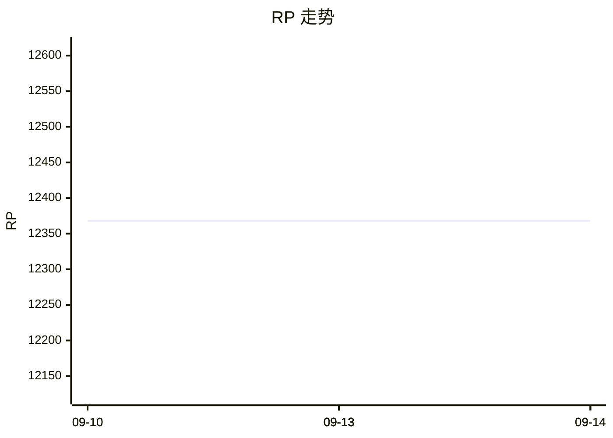

---
tags:
  - apex
  - 战绩
updated: 2026-09-13T19:36:18.168Z
player: L-icet
---

# Apex 战绩 · L-icet

> 🤖 本文件由 `track.mjs` 自动生成，手动修改会在下次采集时被覆盖。
> 最后更新：**2026-09-14 03:36**　·　共 8 次采集

## 当前状态

| 项目 | 值 |
| --- | --- |
| 玩家 | L-icet |
| UID | `1010918821212` |
| 平台 | PC |
| 等级 | **147**（Prestige 2） |
| 段位 | **Diamond IV**　Top 8.65% |
| RP | **12,368** |
| 追踪器 | BR Kills, BR Wins, BR Damage |

## 与上次对比

- （无变化）

## 趋势

**RP**　`▅▅▅▅▅▅▅▅`　12,368

**Career Kills**　`▅▅▅▅▅▅▅▅`　9,164

## 生涯数据

| 指标 | 数值 | 服务器排名 |
| --- | ---: | --- |
| Career Kills | 9,164 | Top 27.25% |
| Career Revives | 825 | Top 61.01% |
| Career Wins | 335 | Top 32.49% |

## 传奇击杀排行

| # | 传奇 | BR Kills |
| ---: | --- | ---: |
| 1 | Valkyrie | 1,057 |
| 2 | Pathfinder | 942 |
| 3 | Bangalore | 605 |
| 4 | Wraith | 486 |
| 5 | Alter | 473 |
| 6 | Newcastle | 457 |
| 7 | Ash | 443 |
| 8 | Mad Maggie | 426 |
| 9 | Conduit | 349 |
| 10 | Horizon | 339 |
| 11 | Lifeline | 317 |
| 12 | Octane | 299 |
| 13 | Mirage | 258 |
| 14 | Ballistic | 215 |
| 15 | Seer | 120 |
| 16 | Fuse | 118 |
| 17 | Rampart | 112 |
| 18 | Caustic | 98 |
| 19 | Wattson | 69 |
| 20 | Bloodhound | 68 |
| 21 | Crypto | 58 |
| 22 | Gibraltar | 57 |
| 23 | Catalyst | 15 |

> 另有 4 个传奇游戏内未挂 BR Kills 追踪器，无法与上面横向比较：
> Revenant（BR Damage 238,303）　·　Loba（BR Season 15 kills 0）　·　Vantage（BR Season 15 kills 107）　·　Sparrow（Tactical: Enemies Scanned 512）

## 最近记录

| 时间 | 等级 | 段位 | RP | Top |
| --- | ---: | --- | ---: | --- |
| 2026-09-14 03:36 | 147 | Diamond IV | 12,368 | 8.65% |
| 2026-09-14 03:32 | 147 | Diamond IV | 12,368 | 8.65% |
| 2026-09-13 12:59 | 147 | Diamond IV | 12,368 | 8.56% |
| 2026-09-13 12:57 | 147 | Diamond IV | 12,368 | 8.56% |
| 2026-09-13 11:54 | 147 | Diamond IV | 12,368 | 8.56% |
| 2026-09-13 11:46 | 147 | Diamond IV | 12,368 | 8.56% |
| 2026-09-10 00:26 | 147 | Diamond IV | 12,368 | 8.26% |
| 2026-09-10 00:26 | 147 | Diamond IV | 12,368 | 8.26% |

---

_存档目录：`data/snapshots/2026-09-13T19-36-15-034Z`_
